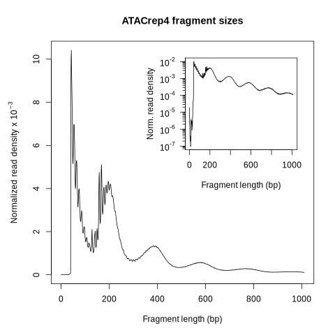
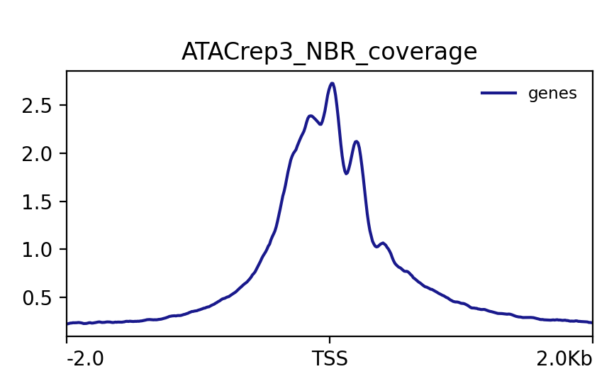
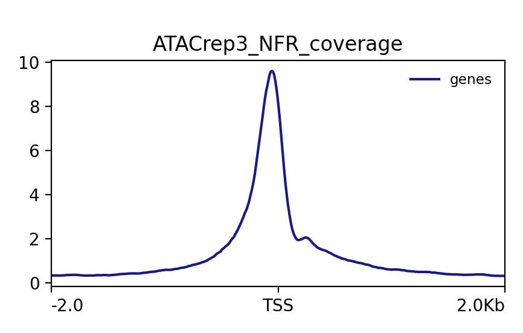
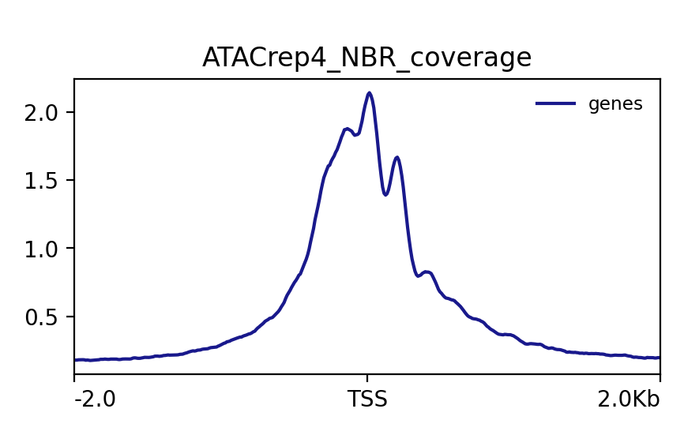
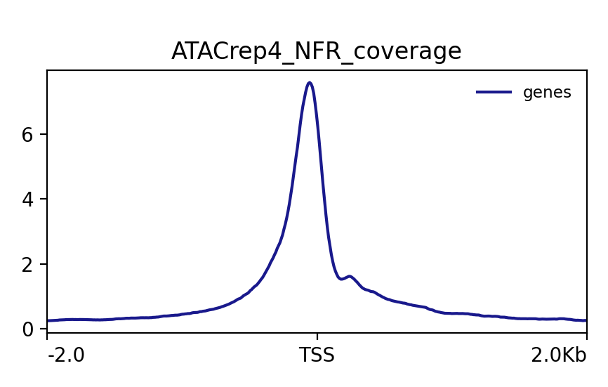
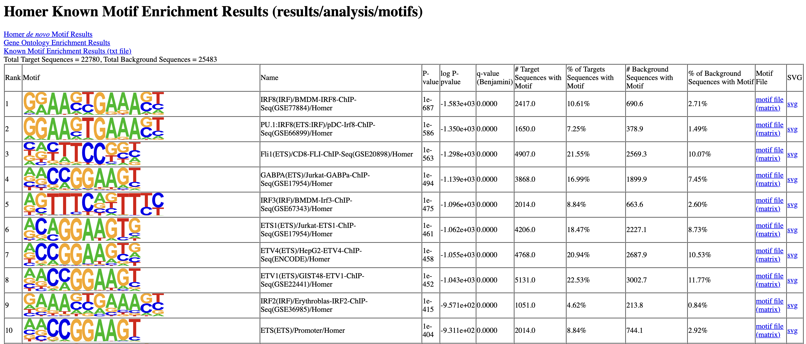
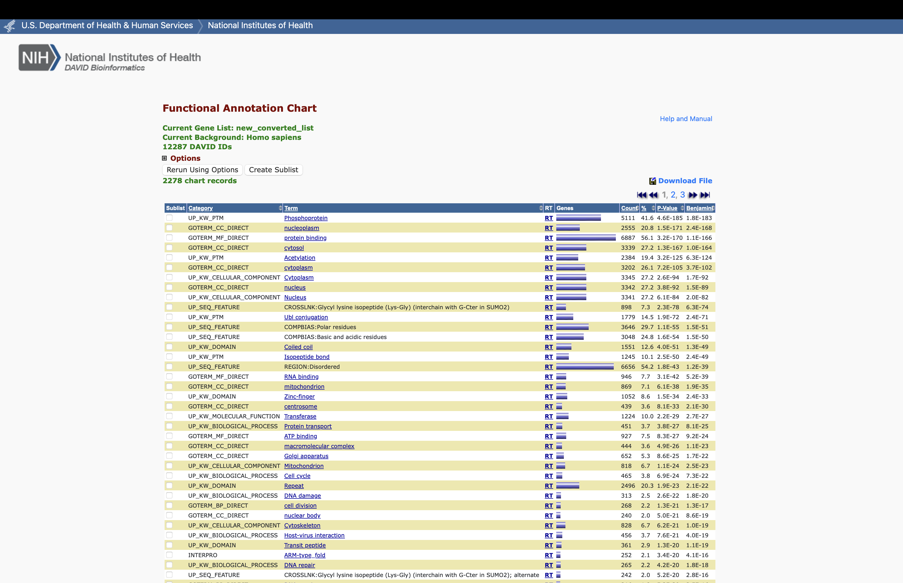

# BF528: Jackson Faulx ATAC-seq Final Project

## Methods:

First, QC was performed on the paired-end reads using fastqc (v0.12.1) and the reads were trimmed using trimmomatic (v0.39). The reads were then aligned to the hg38 genome using bowtie2 (v2.5.3) keeping all unique reads that are less than 2kb in size. The reads were then sorted and indexed, and mitochondrial alignments were removed using samtools (v1.19.2) sort and view respectively. The reads were then sorted and indexed again before being shifted using alignmentSieve from deeptools (v3.5.4). Samtools flagstat and multiqc (v1.20) were performed before and after removing mitochondrial alignments. Read size distribution was then visualized using the ATACSeqQC (v1.26.0) package from bioconductor in R. Peak calling was then performed by MACS3 (v3.0.1) with default parameters. Peak intersection and blacklist region filtering was then performed for the samples using bedtools (v2.31.1) intersect. After the intersecting peaks have been found, homer (v4.11) was then used to generate a file of annotated peaks as well as generate a report of motifs. Signal coverage plots were generated for NFR and NBR regions respectively using the homer tools bamCoverage, computeMatrix, and plotProfile. 


## Workflow and Results

  After downloading the fastq files and performing the fastqc check, I glanced over the metrics for each read for each sample and did not see any significantly issues with the reads. Sequence duplication was flagged by fastqc as an issue, however high levels of sequence duplication are expected in ATAC-seq due to potential conserved binding motifs in non-coding regions. I was able to identify the types of adapters used in the sample preparation and accounted for them when performing trimming. 
  Additional quality control was performed following alignment to the reference, which additionally showed that there are no issues with any of the samples, since all of the reads aligned appropriately. 162,679,456 and 121,196,558 reads aligned for samples 3 and 4 respectively. After indexing and sorting the alignments, I found that 25,997,440 and 20,278,186 reads aligned to the mitochondrial genome in each sample. These reads were filtered out before continuing the analysis. 
  
  
<br>      

<table>
<caption>Number of Alignments</caption>


Sample    Pre_Filtering  Post-Filtering  Mitochondrial Alignments
--------  -------------  --------------  ------------------------
sample 3    162,679,456      25,997,440               136,682,016
sample 4    121,196,558      20,278,186               100,918,372


</table>
  
  I then generated a read length distribution plot using ATACseqQC for each sample, which is shown below. There is a large spike at length < 100, corresponding to nucleosome free regions of DNA. The smaller spikes at ~200 and ~400 bp lengths are mononucleosome and dinucleosome bound regions respectively, which is exactly what is expected in an ATAC-seq analysis. 

```{r}


```
  
  Peak calling was performed on each sample, producing a list of peaks. Sample 3 had 37,332 peaks while sample 4 had 33,931 peaks. In order to find the reproducible peaks, bedtools intersect was performed on the set of peaks files, generating a single file with 22,775 peaks. Peaks falling in blacklist regions were then filtered out, leaving a total of 22,771 reproducible peaks. 
  
  
<table>
<caption>Number of Peaks</caption>


Sample    Number of peaks  Total Reproducible Peaks
--------  ---------------  --------------
sample 3           37,332          22,771
sample 4           33,931          22,771


</table>
  
  
  
  The final bam files were also used to generate signal coverage plots for the unbound and mononucleosome bound regions in each sample as seen below. Generally, the nucleosome free regions have a higher more consistent peak at the TSS compared to the nucleosome bound regions. This is because generally the nucleosome free regions are ~50 bp long, while the bound region fragment length depends on what protein is bound in that region, which explains the wider peak in the NBR graphs. 
  


```{r}




```

 
  A motif analysis was then run of the set of reproducible peaks. The top 10 most enriched motifs are shown below. The top 10 consists of binding sequences for IRF, ETS, and ETV family transcription factors. IRF transcription factors are involved in regulating immune response-related genes, with IRF-8 - the most enriched motif in the data - is involved in the development of granulocyte/monocyte lineage cells. ETS transcription factors are very common in all organisms and have very wide ranging regulatory functions. Lastly, ETV family transcription factors have been linked to FGF mediated growth signaling pathways. These immune and growth related pathways make sense in the context of the sample cells, lymphoblastoids, which are actively growing and dividing cells involves in the immune response.

```{r}

```

  
  After annotating the file of reproducible peaks, a list of genes was generated. I then wrote this list of genes to a file and submitted it to DAVID, a tool for finding enriched functional pathways from a list of genes. DAVID returned the top functional pathways found in the list of genes and sorted them by increasing p-value. The top hits mainly contained basic cellular function pathways including cytoplasm, nucleus, protein binding, metabolism, and replication/translation machinery related pathways. Since the study was essentially a sampling of all of the open chromatin across the genome of a cell, it makes sense that most of the most enriched pathways are related to general cellular functions. Additionally, since lymphoblastoids are actively dividing, that could be the main reason why a lot of cytoplasm, cell structure, and metabolism pathways are enriched in this study.
  
```{r}

```
  
  Finally, the proportions of regions that had accessible chromatin was graphed below. Promoter regions were the majority, since by nature any active promoter sites will have bound TFs. Surprisingly introns were the second largest proportion of open chromatin and exons had the second fewest. Mathematically this makes sense since only 1% of the genome is protein coding however it is interesting that introns still have so much accessible chromatin and adds further complexity to the true functions of introns. ATAC-seq allows us to understand which areas of chromatin are accessible in a given cell which can show what genes or promoters are actively transcribed/bound. Pairing ATAC-seq with other types of NGS analysis can also be beneficial when trying to capture genetic and epigenetic responses in an experiment. 


```{r}
annotated<-read.delim('/projectnb/bf528/students/jfaulx/bf528-individual-project-jfaulx/results/analysis/annotated.txt',sep='\t')
fileConn<-file("gene_list.txt")
writeLines(annotated$Gene.Name, fileConn)
close(fileConn)

pietable <- table(unlist(lapply(strsplit(as.character(annotated$Annotation), " \\("),"[[",1))) 
pie(pietable, main="Regions with Accessible Chromatin")
```


# Citations

1. Andrews S. (2010). FastQC: a quality control tool for high throughput sequence data. Available online at:      http://www.bioinformatics.babraham.ac.uk/projects/fastqc
2. Bolger, A. M., Lohse, M., & Usadel, B. (2014). Trimmomatic: A flexible trimmer for Illumina Sequence Data. Bioinformatics, btu170.
3. Langmead B, Salzberg S. Fast gapped-read alignment with Bowtie 2. Nature Methods. 2012, 9:357-359.
4. Twelve years of SAMtools and BCFtools
Petr Danecek, James K Bonfield, Jennifer Liddle, John Marshall, Valeriu Ohan, Martin O Pollard, Andrew Whitwham, Thomas Keane, Shane A McCarthy, Robert M Davies, Heng Li
GigaScience, Volume 10, Issue 2, February 2021, giab008, https://doi.org/10.1093/gigascience/giab008
5. Ramírez, Fidel, Devon P. Ryan, Björn Grüning, Vivek Bhardwaj, Fabian Kilpert, Andreas S. Richter, Steffen Heyne, Friederike Dündar, and Thomas Manke. deepTools2: A next Generation Web Server for Deep-Sequencing Data Analysis. Nucleic Acids Research (2016). doi:10.1093/nar/gkw257.
6. MultiQC: Summarize analysis results for multiple tools and samples in a single report
Philip Ewels, Måns Magnusson, Sverker Lundin and Max Käller. Bioinformatics (2016)
7. ATACseqQC: a Bioconductor package for post-alignment quality assessment of ATAC-seq data.” BMC Genomics, 19(1), 169. ISSN 1471-2164, doi:10.1186/s12864-018-4559-3, https://doi.org/10.1186/s12864-018-4559-3.
8. 2008: Model-based Analysis of ChIP-Seq (MACS)
9. Aaron R. Quinlan, Ira M. Hall, BEDTools: a flexible suite of utilities for comparing genomic features, Bioinformatics, Volume 26, Issue 6, March 2010, Pages 841–842, https://doi.org/10.1093/bioinformatics/btq033
10. Heinz S, Benner C, Spann N, Bertolino E et al. Simple Combinations of Lineage-Determining Transcription Factors Prime cis-Regulatory Elements Required for Macrophage and B Cell Identities. Mol Cell 2010 May 28;38(4):576-589. PMID: 20513432
11. Buenrostro, J., Giresi, P., Zaba, L. et al. Transposition of native chromatin for fast and sensitive epigenomic profiling of open chromatin, DNA-binding proteins and nucleosome position. Nat Methods 10, 1213–1218 (2013). https://doi.org/10.1038/nmeth.2688
